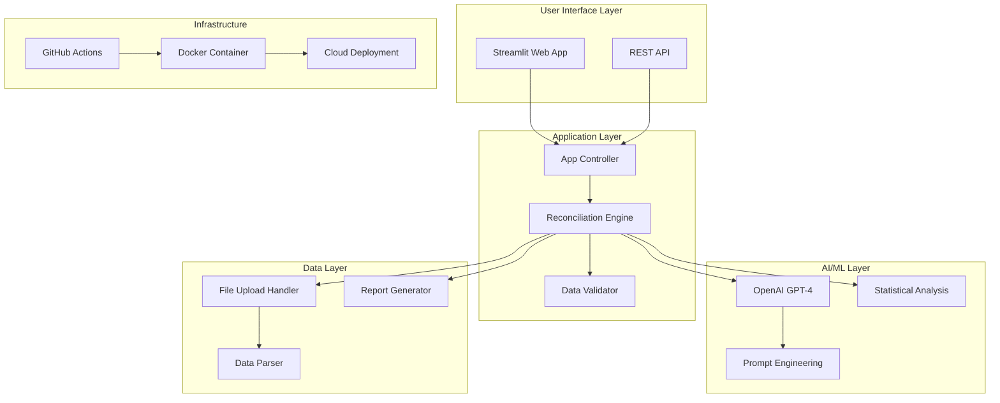
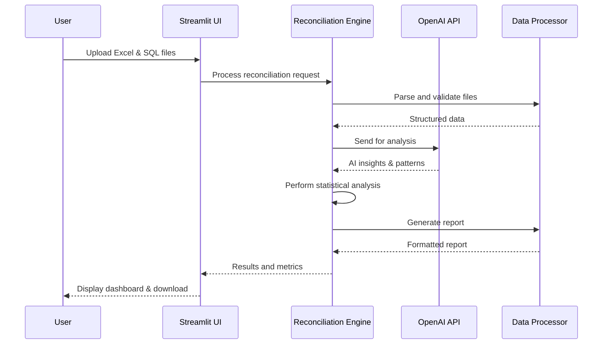
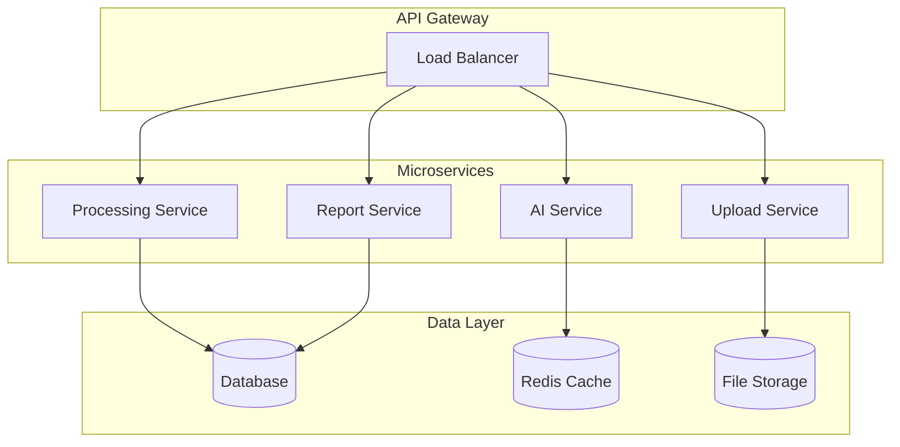

# Architecture Documentation

## System Overview

The Excel-to-SQL Reconciler is a cloud-native application that leverages AI to automate financial data reconciliation processes. Built with modern Python frameworks and designed for scalability.

## High-Level Architecture



## Component Architecture

### 1. Frontend Layer (Streamlit)

**File**: `src/app.py`

```python
# Key Components:
- File Upload Interface
- Progress Tracking
- KPI Dashboard
- Report Download
- Session State Management
```

**Responsibilities**:
- User interaction and file uploads
- Real-time progress tracking
- Results visualization
- Error handling and user feedback

### 2. Core Reconciliation Engine

**File**: `src/utils/reconciliation.py`

```python
# Key Functions:
- perform_reconciliation()
- send_to_openai()
- perform_local_reconciliation()
- generate_reconciliation_report()
```

**Responsibilities**:
- Data processing and comparison
- AI integration and prompt management
- Statistical analysis fallback
- Report generation

### 3. AI Integration Layer

**Provider**: OpenAI GPT-4o-mini

```python
# Capabilities:
- Pattern Recognition
- Anomaly Detection
- Contextual Analysis
- Recommendation Generation
```

**Fallback Strategy**:
- Statistical variance analysis
- Threshold-based matching
- Rule-based discrepancy detection

## Data Flow Architecture



## Technology Stack

### Backend
- **Python 3.12**: Core runtime
- **Streamlit 1.49+**: Web framework
- **pandas/numpy**: Data processing
- **openai**: AI integration
- **pytest**: Testing framework

### Frontend
- **Streamlit Components**: Native UI components
- **Custom CSS**: Enhanced styling
- **JavaScript**: Client-side interactions

### AI/ML
- **OpenAI GPT-4o-mini**: Primary AI engine
- **Custom Prompts**: Forensic accounting expertise
- **Statistical Fallback**: Local analysis algorithms

### Infrastructure
- **Docker**: Containerization
- **GitHub Actions**: CI/CD pipeline
- **Streamlit Cloud**: Deployment platform

## Security Architecture

### 1. API Key Management

```python
# Environment-based configuration
OPENAI_API_KEY = os.getenv('OPENAI_API_KEY')

# Secure transmission
headers = {
    'Authorization': f'Bearer {api_key}',
    'Content-Type': 'application/json'
}
```

### 2. Data Protection

- **No persistent storage** of sensitive financial data
- **Session-based** temporary data handling
- **Memory cleanup** after processing
- **SSL/TLS** encryption for API communications

### 3. Input Validation

```python
def validate_file_format(file):
    allowed_types = ['.csv', '.xlsx']
    return file.name.endswith(tuple(allowed_types))

def sanitize_data(df):
    # Remove potentially harmful content
    # Validate data types and ranges
    return cleaned_df
```

## Performance Architecture

### 1. Processing Optimization

```python
# Chunk processing for large datasets
def process_in_chunks(df, chunk_size=1000):
    for chunk in pd.read_csv(file, chunksize=chunk_size):
        yield process_chunk(chunk)

# Memory-efficient operations
def memory_efficient_merge(df1, df2):
    return pd.merge(df1, df2, how='outer', indicator=True)
```

### 2. Caching Strategy

- **Session State**: UI state persistence
- **Memory Caching**: Processed data during session
- **Result Caching**: Temporary report storage

### 3. Scalability Metrics

| Metric | Current Performance | Target Performance |
|--------|-------------------|-------------------|
| **Records/Second** | 2,000 | 5,000 |
| **Memory Usage** | 50MB/10k records | 30MB/10k records |
| **Response Time** | <30 seconds | <15 seconds |
| **Concurrent Users** | 50 | 200 |

## Deployment Architecture

### 1. Containerization

```dockerfile
# Multi-stage build for optimization
FROM python:3.12-slim as builder
# Dependency installation and optimization

FROM python:3.12-slim as runtime
# Minimal runtime environment
```

### 2. CI/CD Pipeline

```yaml
# GitHub Actions workflow
name: CI/CD Pipeline
on: [push, pull_request]
jobs:
  test:
    # Unit tests, integration tests
  build:
    # Docker image building
  deploy:
    # Cloud deployment
```

### 3. Environment Configuration

| Environment | Configuration | Purpose |
|-------------|---------------|---------|
| **Development** | Local Docker | Development and testing |
| **Staging** | Streamlit Cloud | Pre-production validation |
| **Production** | Cloud Platform | Live application |

## Error Handling Architecture

### 1. Layered Error Handling

```python
try:
    # AI processing
    result = send_to_openai(data)
except OpenAIError:
    # Fallback to statistical analysis
    result = perform_local_reconciliation(data)
except Exception as e:
    # Generic error handling
    log_error(e)
    return error_response()
```

### 2. User-Friendly Error Messages

- **File Format Errors**: Clear guidance on supported formats
- **API Errors**: Fallback options and retry mechanisms
- **Processing Errors**: Detailed progress and error locations

## Monitoring and Logging

### 1. Application Metrics

- **Processing Time**: Per-reconciliation timing
- **Accuracy Metrics**: Match rates and error rates
- **Resource Usage**: Memory and CPU utilization
- **User Activity**: Upload patterns and usage statistics

### 2. Error Tracking

```python
import logging

logging.basicConfig(
    level=logging.INFO,
    format='%(asctime)s - %(name)s - %(levelname)s - %(message)s',
    handlers=[
        logging.FileHandler('reconciler.log'),
        logging.StreamHandler()
    ]
)
```

## Future Architecture Considerations

### 1. Microservices Migration



### 2. Advanced AI Integration

- **Custom Model Training**: Domain-specific financial models
- **Multi-Provider Support**: Azure OpenAI, Google AI, AWS Bedrock
- **Real-time Learning**: Continuous improvement from user feedback

### 3. Enterprise Features

- **Multi-tenancy**: Isolated data processing per organization
- **Role-based Access**: Granular permission management
- **Audit Trail**: Comprehensive reconciliation history
- **API Rate Limiting**: Usage-based throttling

---

*Made by Sanket Karwa*
